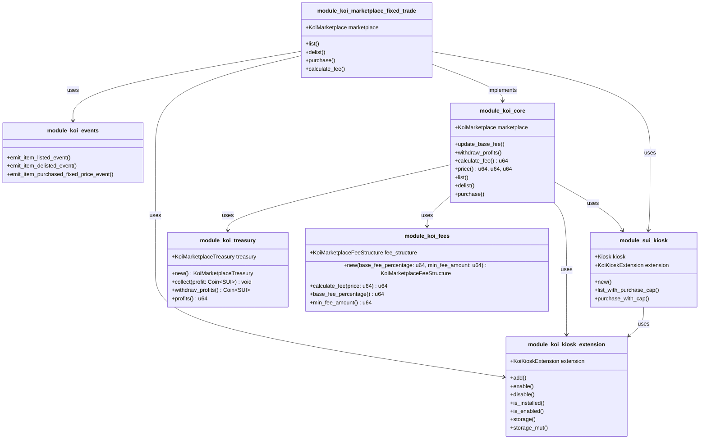
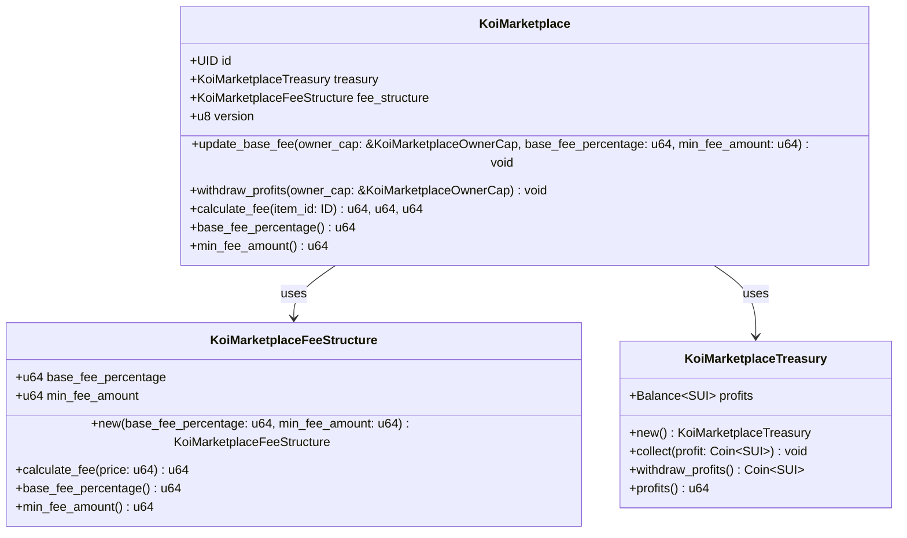
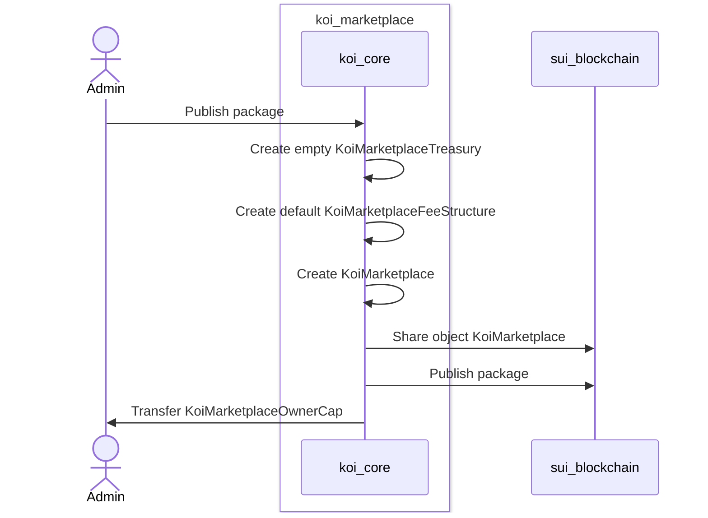
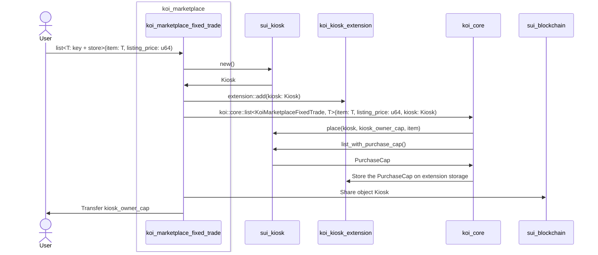
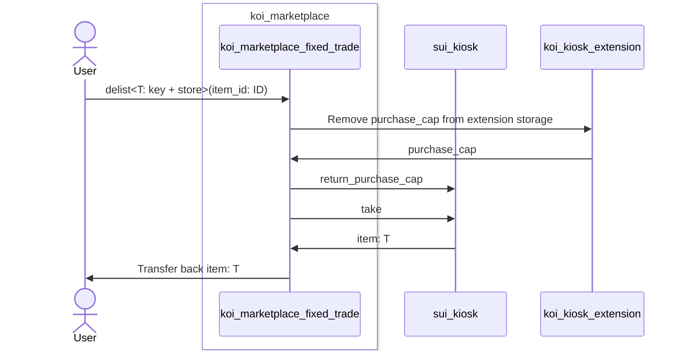
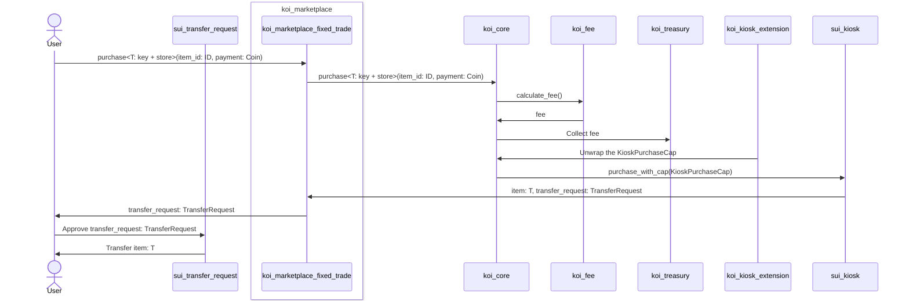
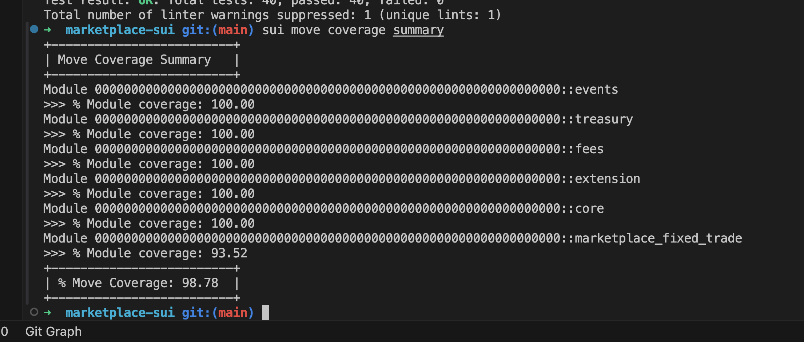
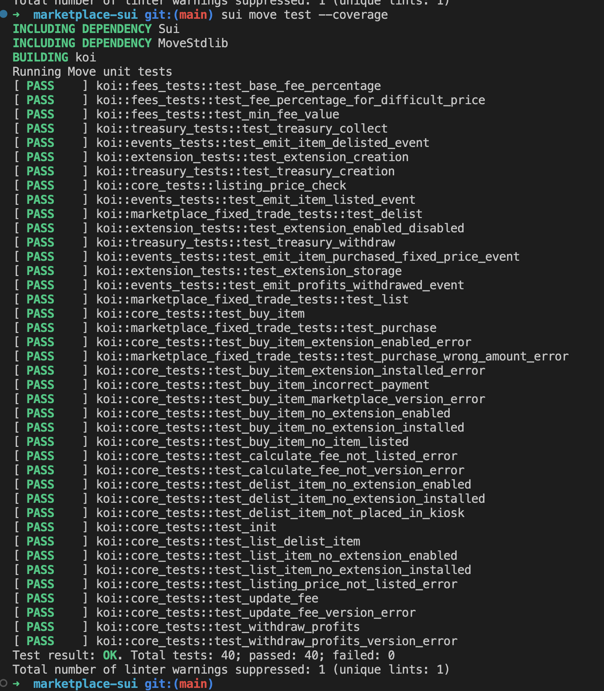

# Koi Marketplace Move Package Documentation :package:

Author: Tirso J. Bello Ponce (tirso@blockus.gg)

# Useful resources

### Github repository

https://github.com/BlockUs0/marketplace-sui

### Audit

[20241119-BlockUs-Final-Audit-Report.pdf](assets/20241119-BlockUs-Final-Audit-Report.pdf)

Conducted by: https://www.movebit.xyz/

# Module organization and structure

Koi Marketplace was built on top of the `Sui Kiosk` in order to make it compatible with Sui Ecosystem and enchance security, performance and good practices.

The marketplace is agnostic to any trade implementation so the main idea is that `koi_core` is just a module that offers tools to list, delist, purchase and cofigure a marketplace to impose different fees and allow different types to be listed.

`koi_core` itself depends on the `Sui Kiosk` module so it is required to have a Kiosk to operate in the marketplace.

Since the main feature of the marketplace is the `Fixed Trade` we have build a module using `koi_core` that handles all the fixed trade logic, the module is called `module_koi_markeplace_fixed_trade` and it’s the entry point for leverage our dApp. Depending our needs we can build any other trade logic on top of our `koi_core` like a Bid system or Item trading using the same principles.

We decided to manage the `Kiosk` in behalf of the user since we feel it gives a better UX to the final user and we leverage our marketplace using SUI features.

The diagram shows the relationship between the diferent modules of the project.

- **module_koi_markeplace_fixed_trade:** Fixed trade implementation for purchases using module_koi_core features. This package will create and manage the kiosk in behalf of the user.
- **module_koi_core:** Package to manage all the core implementations for the marketplace. Esentially manages the fee, treasury and offers utilities like list, delist and purchase. This module assumes that the user already has a kiosk and the extension is installed.
- **module_koi_events:** On-chain events dispatcher.
- **module_koi_tresury:** Contains all the functionalities related to the treasury like collect and withdraw.
- **module_koi_fees:** Package with a set of utilities to calculate the imposed fee on-chain during the purchase transaction. This module can also be updated on-chain so the owner can change the fee structure on demand.
- **module_koi_kiosk_extension: A**llows other modules to install and manage the Koi marketplace kiosk extension to safely operate in the Koi marketplace.

# Koi Marketplace Data Model

The on-chain object that holds the treasury and the configuration is KoiMarketplace. The key part of the architecture, this object will identify the markplace on-chain and will be required to authorize any transaction.

KoiMarkeplace object has a `version` property for upgradeability purposes.

# Deployment

# List an item

# Delist an item

# Purchase an item

# Testing and coverage

**# of unit tests:** 40 unit test ✅

**% of coverage:** 98.78 % ✅

